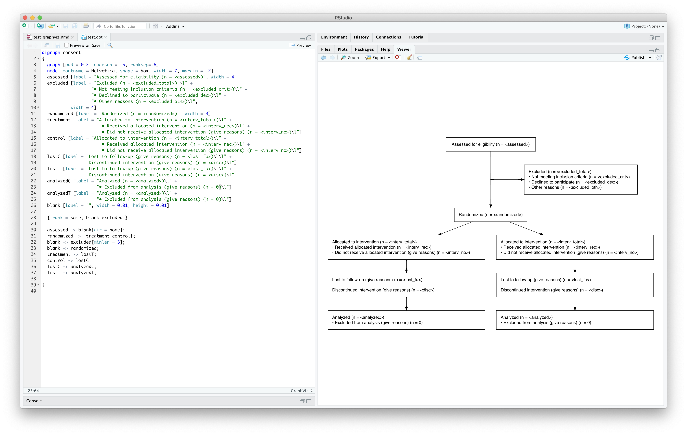

```{r setup, include=FALSE}
knitr::opts_chunk$set(echo = TRUE)
library(magrittr)
```

# Overview

CONSORT diagrams depict "progress through the phases of a parallel randomized trial of two groups (that is, enrollment, intervention allocation, follow-up, and data analysis)" (http://www.consort-statement.org/consort-statement/flow-diagram), and are often required with the submission of a publication.

Word and pdf templates of a CONSORT diagram are available, but manually filling these out leaves a lot to be desired; it loses reproducibility, is error prone, and it becomes tedious when having to update an analysis.

One possible solution is to use [Graphviz](https://graphviz.org), a data visualization software along with the available integration into R and RStudio and `glue` for string interpolation.  


# Graphviz and R/RStudio

The [DiagrammeR](http://rich-iannone.github.io/DiagrammeR/) package brings integration of [Graphviz](https://graphviz.org) and [mermaid.js](http://knsv.github.io/mermaid/) into R, allowing diagrams to easily be created and rendered.  For more information, there's a great blog post by RStudio [here](https://blog.rstudio.com/2015/05/01/rstudio-v0-99-preview-graphviz-and-diagrammer/).

In short, RStudio has a built in editor for `.dot` and `.mmd` files that can then be rendered by `DiagrammeR`:

(ref:screenshot) Graphviz code and output in RStudio

```{r screenshot, echo=FALSE, fig.cap = '(ref:screenshot)'}

```

`dot` and `mmd` code can also be written directly in R code and the passed as a string to `DiagrammeR::grViz` or `DiagrammeR::mermaid`:

```{r fig.width=7.5, fig.height=2, fig.align='center'}
DiagrammeR::grViz("
digraph t {
  rankdir='LR';
  hello -> world
}             
")
```

One major disadvantage here is you lose out on some of the convenience factors of a text editor that supports a language (e.g. syntax highlighting, auto-complete, and debugging tools).

# Variable Interpolation

To get the full benefit of building a consort diagram programmatically, we need the ability to fill in values based on a variable derived in `R`.  `DiagrammeR` has built in support for [string substitution](https://rich-iannone.github.io/DiagrammeR/graphviz_and_mermaid.html#substitution), but the syntax is little clunky and creates a dependency on `DiagrammeR::grViz` to render a diagram.  

Another solution would be to use the string interpolation capabilities of the R package [glue](https://glue.tidyverse.org).

Note that in Figure \@ref(fig:screenshot), sample size values were wrapped in `< >`.  This served two purposes:

* Placeholders during development

* Indicators for `glue` to interpolate a value


Note, by default, `glue` uses curly brackets for the opening and closing delimiters.  `<>` was chosen because they aren't as common in the `DOT` language.  

```{r collapse=TRUE}
greeting <- "Hello"
name <- "John"
glue::glue("{greeting}, {name}. How are you?")
```

With this setup, we can read in a `.dot` file and interpolate the values to something we calculated in `R`.

# CONSORT Example

Let's say we create a file named `consort.dot` in our working directory with the following contents:

```{dot code=xfun::read_utf8("consort.dot"), fig.height=8, fig.width=9.2, eval = F}
```

Then, we derive some values to fill the diagram in with.  These normally would already be derived in your analysis.

```{r}
assessed <- 1000

excluded_total <- 100
excluded_crit <- 70
excluded_dec <- 20
excluded_oth <- 10

randomized <- 900

interv_total <- 450
interv_rec <- 400
interv_no <- 50

lost_fu <- 23
disc <- 2

analyzed <- interv_total - lost_fu - disc
```

Finally, we read in the file, interpolate the values with `glue`, then render with `DiagrammeR`.

```{r fig.height=8, fig.width=8, fig.align='center'}
readr::read_file("consort.dot") %>% 
  glue::glue(.open = "<", .close = ">") %>% 
  DiagrammeR::grViz()
```


```{r eval = FALSE, echo=FALSE}
g %>%
  export_svg() %>%
  charToRaw() %>%
  rsvg_pdf("~/Downloads/conosrt.pdf")
```


